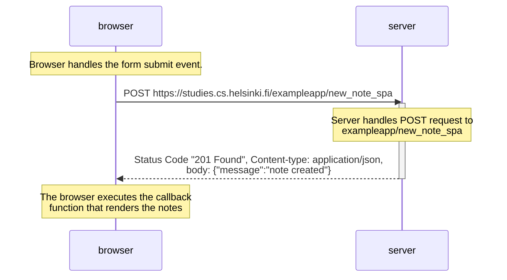

```mermaid
sequenceDiagram
    participant browser
    participant server

    Note over browser: Browser handles the form submit event.
    browser->>server: POST https://studies.cs.helsinki.fi/exampleapp/new_note_spa
    activate server
    Note over server: Server handles POST request to <br/> exampleapp/new_note_spa
    server-->>browser: Status Code "201 Found", Content-type: application/json, <br/> body: {"message":"note created"}
    deactivate server

    Note over browser: The browser executes the callback <br/> function that renders the notes
```
